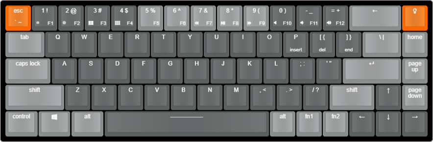

# Keychron-k6
Reversing the K6 to work with QMK

Files:

* QMK Configurator keymap (Based on Tada68)
* [KLE Keyboard Layout](http://www.keyboard-layout-editor.com/#/gists/1a1abe9daf4e5c57407daa1a23500169) | .json
* 

